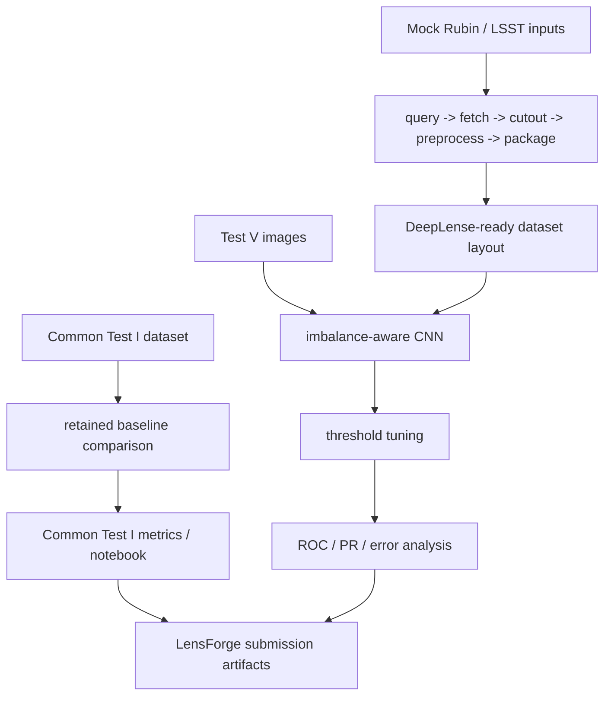

# LensForge: Lens Finding & Data Pipelines

LensForge is a self-contained GitHub submission for the GSoC 2026 DeepLense "Lens Finding & Data Pipelines" evaluation.

[](https://github.com/Atharva12081/LensForge/actions/workflows/ci.yml)


LensForge is built to answer the DeepLense evaluation in a reviewer-friendly way:

- Common Test I is implemented and documented
- Test V is implemented with the strongest retained modeling result in the repository
- the LSST side is represented by both a runnable mock pipeline and a prepared Rubin DP0.2 access path

This repository includes:

- the required Common Test I multi-class classification deliverable
- the project-specific Test V lens-finding deliverable
- a runnable mock LSST-style data pipeline that feeds downstream DeepLense workflows
- a prepared Rubin DP0.2 access notebook with confirmed TAP endpoint reachability and the real TAP/Butler adapter shape
- an optional Test IV neural-operator extension built on the Common Test I dataset

## Reviewer Quickstart

This repository implements the DeepLense GSoC 2026 evaluation submission for:

- Common Test I
- Test V: Lens Finding & Data Pipelines
- a mock LSST-style upstream data pipeline

### 1. Install dependencies

```bash
pip install -r requirements.txt
```

### 2. Review the main deliverables

Open:

```text
output/jupyter-notebook/deeplense-test-v-baseline.ipynb
output/jupyter-notebook/common-test-i-multiclass.ipynb
output/jupyter-notebook/lsst-mock-pipeline.ipynb
output/jupyter-notebook/rubin-dp02-access.ipynb
output/jupyter-notebook/test-iv-neural-operator.ipynb
```

The Rubin notebook is a prepared live-access artifact: the local TAP client has
already been verified to reach `data.lsst.cloud` up to the expected
authentication boundary, and the notebook is ready to run a real DP0.2 TAP
discovery query as soon as a Rubin access token is available. It also
demonstrates the Butler discovery shape inside a Rubin notebook environment.

### 3. Run the main lens-finding baseline

```bash
python train.py --data-root data/lens-finding-test --epochs 5 --batch-size 128 --balance-strategy both
```

### 4. Inspect the saved evaluation summaries

```text
reports/LENSFORGE_REPORT.md
reports/best_current_run.json
reports/common_test_i_experiments_compact.md
reports/lsst_mock_pipeline_summary.md
```

## Executive Summary

LensForge combines three layers of evidence in one repository:

1. evaluation notebooks and saved metrics for the required DeepLense tasks
2. a stronger Test V implementation with imbalance-aware training and threshold tuning
3. a credible Rubin/LSST pipeline story, from mock packaging today to TAP/Butler access when the proper environment is available

## Evaluation Scope

Train a binary classifier that separates lensed galaxies from non-lensed galaxies using:

- `data/lens-finding-test/train_lenses`
- `data/lens-finding-test/train_nonlenses`
- `data/lens-finding-test/test_lenses`
- `data/lens-finding-test/test_nonlenses`

Each sample is a normalized NumPy array with shape `(3, 64, 64)`.

## What is included

- `src/lens_finding_baseline.py`: dataset, model, training loop, evaluation helpers
- `train.py`: CLI entry point for training and evaluation
- `output/jupyter-notebook/deeplense-test-v-baseline.ipynb`: notebook scaffold for the submission workflow
- `output/jupyter-notebook/common-test-i-multiclass.ipynb`: scaffold for the required Common Test I deliverable
- `src/lsst_pipeline/`: runnable mock Rubin/LSST-style query, fetch, cutout, preprocess, and package stages
- `run_lsst_mock_pipeline.py`: entry point for packaging mock-survey inputs into DeepLense-ready folders
- `output/jupyter-notebook/lsst-mock-pipeline.ipynb`: notebook showing the LSST-style packaging workflow
- `output/jupyter-notebook/rubin-dp02-access.ipynb`: notebook for live DP0.2 TAP discovery and Butler-side adapter shape
- `docs/rubin_access_setup.md`: setup notes for the optional Rubin DP0.2 access path
- `docs/lsst_pipeline_design.md`: implementation note for the data-pipeline side of the project brief
- `docs/source_synthesis.md`: source-backed mapping from LSST docs and linked papers to repository design choices
- `docs/gsoc26_evaluation_checklist.md`: requirement-to-artifact checklist for the GSoC 2026 evaluation
- `docs/submission_notes.md`: quick guide for mentor review
- `LICENSE`: MIT license
- `requirements.txt`: Python dependency list
- `reports/`: curated experiment summaries and key JSON metrics
- `reports/LENSFORGE_REPORT.md`: consolidated reviewer-grade summary of the full submission
- `reports/lsst_mock_pipeline_summary.md`: compact end-to-end summary of the pipeline handoff into Test V
- `reports/focal_loss_summary.md`: direct BCE vs focal-loss comparison notes
- `train_common_test_i.py`: multiclass baseline trainer for Common Test I
- `train_test_iv_neural_operator.py`: optional Test IV neural-operator runner on the Common Test I dataset
- `train_common_test_i_radial.py`: handcrafted radial-feature baseline for Common Test I
- `train_common_test_i_fft.py`: FFT radial-feature baseline for Common Test I
- `train_common_test_i_hog.py`: HOG-feature baseline for Common Test I

## Pipeline Overview

Common Test I images
  |
  v
Multi-class baselines
  |
  v
Validation ROC/AUC

Test V survey cutouts
  |
  v
Imbalance-aware CNN
  |
  v
Threshold tuning
  |
  v
ROC / PR / error analysis

Mock LSST-style packaging
  |
  v
DeepLense-ready dataset layout
  |
  v
Downstream lens-finding smoke validation



## Key Features

- End-to-end Test V baseline with class-imbalance handling, threshold tuning, and saved evaluation reports.
- Common Test I coverage with retained reference baselines and notebook documentation.
- Optional Test IV spectral / neural-operator baseline tied directly to the task-folder extension path.
- Runnable mock LSST-style pipeline that packages survey-like inputs into downstream DeepLense format.
- LSST-native provenance concepts such as dataset type, collection, band set, and task-adapter metadata in the packaged pipeline output.
- Explicit source alignment to the linked LSST documentation and DeepLense morphology papers.
- Reproducible repository layout with curated artifacts, notebooks, and review notes.
- GitHub Actions smoke checks for repository integrity.

## Repository Layout

```text
LensForge/
├── src/
│   ├── lsst_pipeline/
│   ├── common_test_i.py
│   └── lens_finding_baseline.py
├── output/jupyter-notebook/
├── reports/
├── docs/
├── tests/
├── models/
├── data/
├── train.py
├── train_common_test_i.py
├── run_lsst_mock_pipeline.py
├── pyproject.toml
├── requirements.txt
└── environment.yml
```

## Quickstart

Install dependencies with:

```bash
python3 -m pip install -r requirements.txt
```

Then run the Test V baseline with:

```bash
python3 train.py \
  --data-root "data/lens-finding-test" \
  --epochs 5 \
  --batch-size 128 \
  --train-fraction 0.25 \
  --balance-strategy both \
  --test-fraction 0.25
```

This command uses a stratified 90:10 split on the training folders for validation and also reports metrics on the provided test folders.

Use `--test-fraction < 1.0` for quicker iteration during development, then switch back to `1.0` for a final report.

## Results snapshot

- Test V best recorded run:
  - validation ROC-AUC: `0.9753`
  - validation PR-AUC: `0.7043`
  - test ROC-AUC: `0.9659`
  - test PR-AUC: `0.3795`
  - test precision: `0.4082`
  - test recall: `0.5128`
  - setup: focal loss on the full training split with PR-AUC checkpoint selection
- Common Test I best recorded run:
  - validation accuracy: `0.6144`
  - validation macro ROC-AUC: `0.8333`
  - setup: explicit stratified `90:10` validation split with the polar-view CNN and no augmentation
- Optional Test IV spectral baseline:
  - validation accuracy: `0.3333`
  - validation macro ROC-AUC: `0.5245`

Artifact sources:

- `reports/LENSFORGE_REPORT.md`
- `reports/best_current_run.json`
- `reports/common_test_i_polar_9010_noaug_long.json`
- `reports/common_test_i_experiments_compact.md`
- `reports/test_iv_spectral.json`
- `reports/lsst_mock_pipeline_run.json`

## Mock LSST pipeline

Run the pipeline layer with:

```bash
python3 run_lsst_mock_pipeline.py \
  --data-root "data/lens-finding-test" \
  --output-root "tmp/lsst_mock_pipeline" \
  --max-per-folder 16 \
  --report-path "reports/lsst_mock_pipeline_run.json"
```

This packages a small mock-survey subset into:

```text
tmp/lsst_mock_pipeline/deeplense_dataset/
```

with the same `train_lenses`, `train_nonlenses`, `test_lenses`, and `test_nonlenses` layout consumed by `train.py`.

## Data layout

Keep the dataset inside the repository at:

```text
data/lens-finding-test/
```

with the four class folders under it.
The benchmark arrays themselves are not committed in this repository, so a fresh
clone will need those folders populated locally before the full Test V training
or mock-pipeline commands can reproduce the saved reports.

Keep the Common Test I dataset inside the repository at:

```text
data/common-test-i/
  train/no
  train/sphere
  train/vort
  val/no
  val/sphere
  val/vort
```

As with Test V, the committed repository keeps the reports and notebook
artifacts, not the raw challenge arrays.

## Baseline strategy

- Use a compact PyTorch CNN tailored to `(3, 64, 64)` inputs.
- Handle severe class imbalance with both `WeightedRandomSampler` and `BCEWithLogitsLoss(pos_weight=...)`.
- Tune the classification threshold on the validation split instead of assuming `0.5`.
- Report ROC-AUC as the main metric, plus PR-AUC, confusion matrix values, and loss curves.
- Save validation and test ROC/PR curve data into the run report for notebook visualization.
- Save the main Test V checkpoint to `models/best_current_run.pt`.

## Reproducibility

- Python version is pinned in `.python-version` and `environment.yml`.
- Core reviewer-facing artifacts are committed in the repository.
- Notebook files are validated by repository smoke tests.
- The repository includes a lightweight CI workflow for structural verification.

## Current status

- Common Test I is implemented with multiple baseline families and a dedicated notebook.
- Test V is implemented with imbalance handling, threshold tuning, error analysis, and saved reports.
- The LSST/data-pipeline side is represented by a runnable mock-survey packaging workflow plus a downstream smoke test.
- The explicit GSoC 2026 evaluation requirements are mapped in `docs/gsoc26_evaluation_checklist.md`.

## Review order

If you are evaluating the repository quickly, the recommended order is:

1. `docs/submission_notes.md`
2. `docs/gsoc26_evaluation_checklist.md`
3. `reports/LENSFORGE_REPORT.md`
4. `output/jupyter-notebook/deeplense-test-v-baseline.ipynb`
5. `output/jupyter-notebook/common-test-i-multiclass.ipynb`
6. `output/jupyter-notebook/lsst-mock-pipeline.ipynb`

## Development and Tests

```bash
pytest -q
```

The test suite uses lightweight synthetic arrays to smoke-test the training
CLIs, notebook structure, and the LSST-style packaging pipeline without
requiring the full benchmark datasets in `data/`.

## License

This project is licensed under the MIT License. See `LICENSE`.
