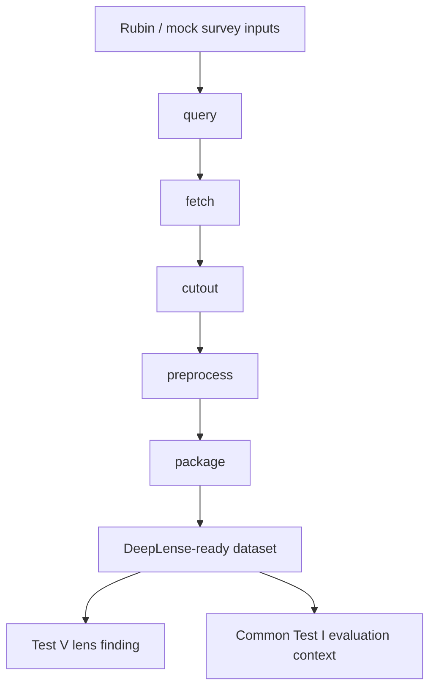

# LensForge Evaluation Report

LensForge is the GSoC 2026 DeepLense evaluation submission for the `Lens Finding & Data Pipelines` track. The repository is organized around three reviewer-visible outcomes:

- a complete Common Test I baseline
- a strong Test V lens-finding baseline
- a runnable mock Rubin/LSST-style upstream pipeline

## Evaluation Goals

The project brief combines two expectations:

1. solve the required DeepLense evaluation tasks
2. demonstrate a credible data-processing path from Rubin-style survey access into DeepLense-ready model inputs

LensForge addresses both.

It also now includes one optional optimization drawn directly from the task sheet: a lightweight Test IV neural-operator baseline on the Common Test I dataset, kept as an exploratory extension rather than a primary result.

## Deliverables Included

### Common Test I

- training entry point: `train_common_test_i.py`
- reviewer summary: `reports/common_test_i_summary.md`
- baseline families:
  - CNN baseline
  - polar-view CNN baseline
  - FFT radial-feature baseline
  - HOG-feature baseline
- notebook: `output/jupyter-notebook/common-test-i-multiclass.ipynb`

Best retained validation result:
- accuracy: `0.9141`
- macro ROC-AUC: `0.9849`
- evaluation setup: full combined train+val pool, explicit stratified `90:10` validation split, wider `width=32` polar-view CNN, no augmentation, cosine schedule

### Optional Test IV Neural Operator Extension

- runner: `train_test_iv_neural_operator.py`
- backbone family: lightweight spectral / neural-operator-style classifier
- notebook: `output/jupyter-notebook/test-iv-neural-operator.ipynb`

Recorded exploratory validation result:
- accuracy: `0.3333`
- macro ROC-AUC: `0.5245`

This does not outperform the retained Common Test I polar baseline, but it does show that the repository now covers the optional neural-operator direction explicitly referenced in the task materials.

### Test V

- training entry point: `train.py`
- core implementation: `src/lens_finding_baseline.py`
- notebook: `output/jupyter-notebook/deeplense-test-v-baseline.ipynb`
- imbalance handling:
  - weighted sampler
  - weighted BCE loss
  - tuned validation threshold

Best retained recorded result:
- validation ROC-AUC: `0.9753`
- validation PR-AUC: `0.7043`
- test ROC-AUC: `0.9659`
- test PR-AUC: `0.3795`
- test precision: `0.4082`
- test recall: `0.5128`

### LSST / Rubin Pipeline Path

- mock pipeline runner: `run_lsst_mock_pipeline.py`
- implementation package: `src/lsst_pipeline/`
- notebook: `output/jupyter-notebook/lsst-mock-pipeline.ipynb`
- Rubin access notebook: `output/jupyter-notebook/rubin-dp02-access.ipynb`

This gives LensForge both:
- a runnable in-repo mock-survey packaging workflow
- a documented real-access bridge for Rubin DP0.2 TAP and Butler discovery
- a source-backed design path aligned with LSST Butler concepts and the linked DeepLense morphology papers

## System Design

## Why Test V Is the Strongest Part

Test V is where LensForge currently demonstrates the strongest modeling maturity:

- the class imbalance problem is handled explicitly
- threshold selection is treated as part of evaluation, not ignored
- the repo reports PR-AUC as well as ROC-AUC, which matters more than ROC-AUC alone in the rare-positive lens-finding setting
- the repo keeps error-analysis summaries instead of reporting a single headline score
- the saved checkpoint and notebook make the result easy to inspect

This is the clearest place where LensForge is competitive as a submission: the final retained Test V run preserves meaningful ranking quality on the imbalanced provided test split instead of relying only on validation AUC.

## Why the LSST Component Matters

The project brief is not only about training a classifier. It also asks for a functional pipeline that can interface Rubin/LSST-style data with DeepLense workflows.

LensForge therefore includes:

- a mock pipeline that already transforms survey-like inputs into the downstream folder schema used by the lens finder
- a DP0.2 access notebook that documents the real TAP and Butler entry points the future live adapters should wrap
- packaged provenance fields such as dataset type, collection, and band set so the mock path already resembles a Rubin-style data product interface

This makes the submission more than a model-only answer.

## Reproducibility and Reviewability

- reviewer-facing notebooks are committed
- curated JSON and Markdown reports are committed
- the repository has smoke tests and CI checks
- Python version and dependency files are included
- model weight for the main Test V checkpoint is included

## Current Limits

- the raw benchmark datasets are not committed, so full reruns require local placement of the challenge data
- the Rubin live-access notebook still depends on external credentials and environment-specific Rubin packages
- Common Test I is now much stronger than the earlier retained baseline, but its validation-only reporting still makes Test V the more directly deployment-like benchmark in the repository

## Overall Assessment

LensForge should be read as a complete, reviewer-friendly evaluation submission:

- technically complete against the requested deliverables
- strongest on Test V and pipeline framing
- honest about the current limits of Common Test I and live Rubin access
- organized to make mentor review fast and low-friction

If compared against model-only example submissions, the main LensForge advantage is not that every metric is the best in every task. It is that the repository combines:

- a strong Test V result evaluated with imbalance-aware metrics
- full task coverage including Common Test I
- an upstream LSST-style packaging story
- reviewer-friendly artifacts, documentation, and reproducibility structure
